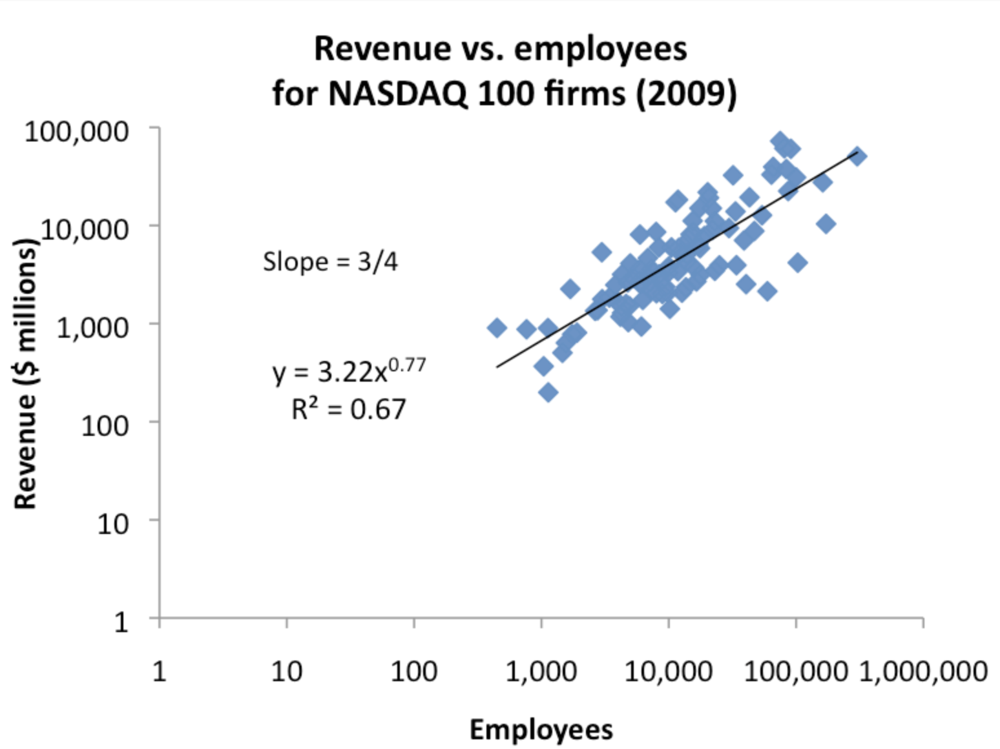

# Specter Analysis

## Specrter App

Deployed on AWS App Runner [here](https://iw3awh3exj.eu-west-1.awsapprunner.com/)

### Running the App locally

Install `requirements.txt` in chosen virtual environment. In the `src` directory run `python app.py` and navigate to http://127.0.0.1:8050/

### Deploying & Updating the App - Heroku
**NO LONGER USED**

~~Install dashtools with `pip install dash-tools` and run `dashtools heroku --deploy` to deploy your app and `dashtools heroku --update` to update your app.~~

### Deploying & Updating the App - AWS App Runner

_Heroku deployment had issues, due to being a new account, I could not updgrade to premium tiers and therefore suffered with performance issues._

To deploy on AWS App Runner, first need to push a docker image to ECR. This can be done by running `./build_deploy_image_m1.sh` (for M1 silicon Macs only).

In AWS App Runner, create a new service, and select the ECR image. The service will be created and deployed. Configure to automatically update new versions of the image. As such, to update the app, simply push a new version of the image to ECR by updating `src/version.env` and running `./build_deploy_image_m1.sh` again.

**NOTE:** You may need to run `chmod +x build_deploy_image_m1.sh` to make the script executable.

## Exploration

See `notebooks/` directory for exploratory analysis.

**NOTE:** The folder contains it's own `requirements.txt` file.

### Ranking

**Identify companies that are showing high growth and rank them**

Growth is defined as a company's ability to increase its user base, revenue, or other metrics over time. Ideally we would have revenue data, however if a company is selling an app, app downloads may work as a good proxy. Other metrics such as web vists, social media followers, number of employees, etc. could also be used. Indeed, the number of employees has been shown to have a strong relationship with revenue (see below).

The `GROWTH_METRICS` variable in `src/config.py` shows all the metrics used to calculate a ranking based on growth. For each metric, the monthly growth was available over a six month duration. To quantify the growth over this period and compare companies, linear regression was performed (if 3 or more data points were available) using least squares on each company for each metric. The slope of the line calculated was then used as a growth score for that metric.

The slope was normalised with respect to the baseline of the metric so that a comparison between companies could be made. For example, the normalisation factor for employees growth was the `Employee Count` (again refer to the `GROWTH_METRICS` variable in `src/config.py`). This was so, a company with 5000 employees who added 100 employees to their workforce (2% increase) would have a slope that is much lower than a company with 50 employees who added 100 employees to their workforce (300% increase).

When observing the growth score distributions of different metrics, it was found that some distributions had large outliers which could potentially inflate the impact of that metric on an overall 'Ranking' score. To manage this issue, the resultant metric slopes were transformed using a `quantile_transform` (see the `_normalized_growth` function in `src/preprocess.py`). This transformed the data to a normal distribution, with the outliers being pushed towards the mean. This was done to ensure that the outliers did not have a disproportionate impact on the overall ranking score.

The overall ranking score was then calculated by taking the mean of the normalized slopes for each metric. A weighted mean would be an additional feature to consider.

#### Note on Employees

A [2012 blog by ProtoBi](https://protobi.com/post/revenue-per-employee-and-biologic-scaling-laws) shows that the number of employees is a good proxy for revenue. The plot shows that the number of employees is correlated with revenue via a power-law.

$ ~revenue  ~\alpha  ~employees^{0.77} $

This scaling law basically means that if the number of employees doubles, the revenue goes up by less than 2 (~1.7), i.e. not directly proportional to employee growth. 

One thing to note re. this relationship, it is derived on data for companies with between ~200-100,000 employees and as such, the relationship may not hold for companies with fewer employees.

### Industry Classification

**Identify the industry of a company**

Build a taxonomy model that can populate the 'New Industry' column with 'Finance', 'Health', or 'Finance; Health', depending on the following datapoints:
- Description
- Industry
- Category Groups
- Tags

We need a taxonomy classifier with only 3 classes, although it makes sense to add a fourth class for 'Other' or 'Unclassified'.

#### Zero-shot approach

As we have limited data, we can use a zero-shot approach to classify companies into the 3 classes. We can use the [Zero-Shot approach](https://huggingface.co/spaces/joeddav/zero-shot-demo) to do this.

Pros:
- Requires no training
- Works well on common topics

Cons:
- No ability to modify
- Large model - slow to run

**Note:** can also be used to create an initial label set for later use e.g. [this](https://www.vennify.ai/generating-training-data-zero-shot/) article shows the application of zero-shot to create an initial label set on which a simple classifier can be trained & modified going forward.

#### Fine-tuning approach

[SetFit](https://github.com/huggingface/setfit) is a library that allows you to fine-tune a model on a limited set of labels - in the 'few shot' regime. It is a recent approach and has shown very strong performance. It fine-tunes a sentence-transformer using contrastive siamese training with a classification head (typically log reg).

Pros:
- Shown to be high-performing in the few-shot regime
- Only requires a small set of training data

Cons:
- Requires human-in-the-loop to label
- Cold-start problem - need an initial set (can be based on keywords) 

#### Naive classifier approach

We have existing industry classifications for 'Finance' and 'Health' related categories. We can use these to train a two classifiers, one for 'Finance' and one for 'Health'. Using the probability scores from these two classifiers, we could classify a company as 'Finance; Health' if the probability scores are above a certain threshold for both classifiers i.e. Finance > 0.5 and Health > 0.5.

|        Industry                          | Count |
|------------------------------------------|-------|
| Financial Services                       | 402   |
| Hospitals and Health Care                | 86    |
| Mental Health Care                       | 34    |
| Health and Human Services                | 1     |
| Retail Health and Personal Care Products | 1     |
| Public Health                            | 1     |

This is naive in the sense that it assumes that these existing related industry classifications are the same as the new industry classifications we are creating. In reality, one could argue they are a sub-industry but it is hard to know what the definition of 'Finance', 'Health' and 'Finance; Health' are without more information and how they relate to these.

Pros:
- Quick to train
- Based on this dataset - more applicable to this task

Cons:
- Very limited training data (~100 for Health)
- Create a fixed view of the world based on related industry classifications

**NOTE**: Under the taxonomy field "Category Groups" there are 29 examples where both of the the words 'health' and 'financial' are used.

| Category                                          | Count |
|---------------------------------------------------|-------|
| Financial Services, Health Care                   | 8     |
| Administrative Services, Financial Services, H... | 4     |
| Financial Services, Health Care, Software         | 2     |
| Financial Services, Health Care, Sports           | 1     |
| Financial Services, Health Care, Lending and I... | 1     |
...

## TODO

### Ranking app
- [x] make a simple dash app
- [x] [deploy](https://dash.plotly.com/deployment)
- [x] analyze potential growth metrics
- [x] preprocess data and generate metrics
- [x] add visualizations for growth metrics
- [x] create interactive components to dig through data
- [x] add password protection
- [ ] further exploration of the approach - see [ranking_exploration notebook](notebooks/ranking_exploration.ipynb)

### Industry classification
- [x] investigate industry classification task
- [x] come up with new industry classification approaches
- [x] implement one approach and analyze results
- [x] embed output in dash app
- [ ] fix zero-shot bug - if the batch contains only one example, the pipeline will miss it
